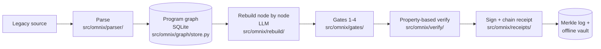
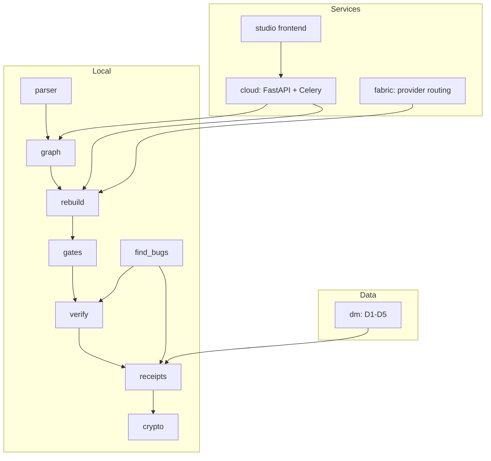

# OMNIX Architecture

OMNIX is a graph-native legacy-code migration system. It parses a legacy
codebase into a typed program graph, rebuilds individual graph nodes into a
modern target language with an LLM, runs each rebuild through a staged
verification pipeline, and signs every bug-finding and every rebuild with a
hybrid post-quantum + classical signature that is chained into a Merkle log.
The signing design means an auditor can verify the entire trail offline, with
no network and no trust in the machine that produced it. A separate
data-migration arm (OMNIX-DM, stages D1–D5) and a cloud orchestrator
(FastAPI + Celery) reuse the same receipt and crypto primitives. This document
describes how the pieces fit together and names the modules that implement each
stage. Be aware of the honest status boundary throughout: gates 5 and 6 are
implemented as *deferred* markers, not faked passes.

## End-to-end pipeline



## Major subsystems



| Package | Role |
| --- | --- |
| `src/omnix/parser/` | Tree-sitter ingestion and language-specific symbol passes. |
| `src/omnix/graph/` | SQLite-backed typed program graph (`store.py`, `exporter.py`). |
| `src/omnix/rebuild/` | Per-node LLM rebuild runner. |
| `src/omnix/gates/` | Mechanical gates 1–4. |
| `src/omnix/verify/` | Hypothesis-driven property verification engine. |
| `src/omnix/receipts/` | Receipt schemas, Ed25519 + ML-DSA-65 signing, Merkle chaining. |
| `src/omnix/crypto/` | FIPS-204 ML-DSA-65 wrapper. |
| `src/omnix/find_bugs/` | Whole-codebase bug scan with signed findings. |
| `src/omnix/dm/` | Data-migration stages D1–D5. |
| `src/omnix/cloud/` | FastAPI API, Celery tasks, durable persistence. |
| `src/omnix/fabric/` | Provider Fabric: LLM dispatch, budgets, pricing. |
| `src/omnix/studio/` | Localhost Studio server and React frontend. |

## Core pipeline

The local pipeline runs **parse → typed program graph → rebuild → gate
verification → signed receipt**.

1. **Parse.** `src/omnix/parser/` ingests source with Tree-sitter. A universal
   pass (`universal.py`) handles packaged grammars (Python, TypeScript, Java,
   Go, Ruby, Rust), and specialist passes (`python_parser.py`,
   `typescript_parser.py`) extract richer symbols and call edges.
   `ingest_dispatch.py` routes files to the right pass, and grammar visibility
   is exposed through `grammar_status_query.py`.

2. **Typed program graph.** Nodes and edges are written to SQLite by
   `src/omnix/graph/store.py` (`GraphStore`). `exporter.py` serializes the graph
   for downstream consumers and the Studio frontend.

3. **Rebuild.** `src/omnix/rebuild/runner.py` topologically walks the graph,
   builds a per-node prompt with dependency context, dispatches an LLM call
   through the orchestrator/Fabric boundary, and produces a candidate rebuild
   for one node at a time.

4. **Gate verification.** `src/omnix/gates/runner.py` runs gates 1–4 over the
   rebuilt code (see below). The verify engine in `src/omnix/verify/` adds the
   property-based layer.

5. **Signed receipt.** `src/omnix/receipts/rebuild_receipt.py` builds a
   canonical-JSON `RebuildReceipt`, which is signed and written by the rebuild
   runner alongside the rebuilt source.

## The program graph

The graph is the substrate everything else reads. `GraphStore` in
`src/omnix/graph/store.py` stores two core tables in SQLite:

- **nodes** — `id`, `name`, `type` (function, class, etc.), `file_path`,
  `start_line`/`end_line`, `complexity`, and a JSON `metadata` blob.
- **edges** — `source_id`, `target_id`, and a `relationship` label, plus JSON
  metadata. The key relationship for migration is **`CALLS`**, the
  function-to-function call edge.

The store opens in WAL mode with indexes on `file_path`, edge source, edge
target, and `(source_id, relationship)` so call traversal is cheap. An
evolution schema (`apply_evolution_schema`) and `file_hashes` /`meta` tables
support incremental re-parsing.

**Cross-file call resolution** is implemented for Python, TypeScript, and Rust.
In `python_parser.py`, `_resolve_callee` builds a symbol index keyed by short
name, prefers a candidate in the caller's own file, and otherwise falls back to
the best cross-file match before adding the `CALLS` edge. TypeScript resolution
lives in `typescript_parser.py`, and Rust call ingestion in
`universal.py` (`_ingest_rust`). Calls that cannot be resolved are left
explicit rather than silently dropped.

## Verification and receipts

OMNIX defines a **six-gate** verification model. Only gates 1–4 run
mechanically today; gates 5 and 6 are **deferred and marked as such** — never
reported as passed or failed. The canonical vocabulary in
`src/omnix/receipts/rebuild_receipt.py` makes this an enforced invariant:
`VALID_GATE_STATUSES` includes `deferred_m2`, and `M2_DEFERRED_GATES = {5, 6}`.
Conflating "no verification ran" with "verification passed" would defeat the
receipt's value, so it is structurally disallowed.

| Gate | Name | Module | Status |
| --- | --- | --- | --- |
| 1 | syntactic | `src/omnix/gates/gate1_syntactic.py` | runs |
| 2 | typecheck | `src/omnix/gates/gate2_typecheck.py` | runs |
| 3 | signature | `src/omnix/gates/gate3_signature.py` | runs |
| 4 | dependency | `src/omnix/gates/gate4_dependency.py` | runs |
| 5 | property-based | `src/omnix/verify/` (full coverage in M2) | deferred |
| 6 | behavioral equivalence | (M2) | deferred |

`src/omnix/gates/runner.py` runs gates 1–4 without short-circuiting: every gate
executes even if an earlier one failed, and a gate crash is captured as a
structured error rather than discarding the other gates' signals. The
property-based engine in `src/omnix/verify/runner.py` drives Hypothesis against
the target under sandbox constraints; `src/omnix/find_bugs/` reuses it for
whole-codebase scans.

**Signing.** Each finding and each rebuild carries a hybrid signature: a
classical **Ed25519** signature plus a post-quantum **ML-DSA-65** (FIPS 204)
signature. The Ed25519 path is in `src/omnix/receipts/finding_keys.py`
(`Ed25519PrivateKey` keys, detached signatures); the ML-DSA-65 path is
`sign_bytes_mldsa` in the same module, backed by the wrapper in
`src/omnix/crypto/ml_dsa_65.py` (over `dilithium-py`, with the pure-Python FIPS
implementation under `src/omnix/receipts/` — `ntt.py`, `poly.py`, `sampling.py`,
`sign.py`, `verify.py`).

**Merkle chaining and offline verification.**
`src/omnix/receipts/merkle.py` builds a deterministic Merkle tree
(RFC 6962-style, duplicating the last node on odd levels) over receipt leaf
hashes and exposes `verify_inclusion`. Scan manifests are signed with ML-DSA-65
over the Merkle root, so an auditor can detect changed bytes, missing findings,
or manifest tampering entirely offline. `export_vault.py` packages a portable
audit bundle for that purpose.

## Data migration (OMNIX-DM)

OMNIX-DM is the data-migration arm beneath the code replicator. It runs in five
stages under `src/omnix/dm/`, each emitting signed, inspectable artifacts rather
than a claim of proven correctness:

- **D1 — schema understanding** (`d1_schema_understanding/`): parse legacy and
  target DDL, extract metadata, propose column mappings with confidence and
  review flags. Receipt: `column-mapping.json`.
- **D2 — edge-case profiling** (`d2_edge_case_profiling/`): plan and run probes
  for mapped columns, surfacing blockers explicitly. Receipt:
  `edge-case-manifest.json`.
- **D3 — transformation synthesis** (`d3_transformation_synthesis/`): generate
  per-column transformer specs, with halt receipts when synthesis fails.
- **D4 — bulk import** (`d4_bulk_import/`): apply specs to every legacy row,
  write target batches, quarantine failures.
- **D5 — change data capture** (`d5_change_data_capture/`): replay PostgreSQL
  logical changes after D4, track lag, and emit cutover proposals. Oracle/MySQL
  adapters are intentionally stubbed.

D1/D2 manifests are ML-DSA-65 signed and chained by SHA-256 predecessor hash
for a tamper-evident audit trail (`src/omnix/dm/receipts/`). See
[`docs/dm/README.md`](docs/dm/README.md) for stage status and the academic
foundation.

## Cloud orchestrator

`src/omnix/cloud/` is the optional managed surface. `cloud/api/main.py` builds a
FastAPI app (`create_app`) mounting health/version, replication jobs, resumable
upload, git ingestion, auth callback, cutover control, and a WebSocket
gate-progress stream, with CORS scoped to the configured origin in production.
Long-running work is dispatched to **Celery** workers (`cloud/tasks/celery_app.py`),
configured for at-least-once delivery with idempotent task bodies.

**Tenant isolation** is enforced in the persistence layer:
`cloud/store.py` and `cloud/db/models.py` carry a `tenant_id` on jobs and
events, with helpers such as `get_job_tenant` and per-tenant subscription tiers.
Durable persistence is **opt-in** — when it is off, the store degrades to a
no-op rather than failing, keeping the API usable without a database.

## Studio frontend

`src/omnix/studio/` is a localhost graph explorer. The Python side
(`server.py`, `watcher.py`, `parser_bridge.py`, `ws_protocol.py`) serves the
graph and streams updates over WebSocket. The frontend
(`src/omnix/studio/frontend/`) is a React 18 + TypeScript app built with Vite,
using Zustand for state, Monaco for code views, and D3/PixiJS for graph
visualization.

## Provider-key vault

OMNIX supports bring-your-own-key (BYOK) for LLM providers through two vaults.
The browser vault lives in `src/web/vault/` (`vault.js`, `crypto.js`,
`session.js`, `storage.js`): a passphrase-derived, client-side encrypted store
that never short-circuits its KDF and unlocks only with a valid passphrase or
session. A server-side counterpart, `src/omnix/receipts/provider_vault.py`,
provides an AES-GCM encrypted key store (HKDF-derived) for Provider Fabric
BYOK. Routing, budgets, and pricing live in `src/omnix/fabric/`.

## Security posture

OMNIX's verification engine executes the function under test in a sandboxed
child process (low `RLIMIT_AS`, wall-clock timeout, isolated session) and runs
only checked-in harness code plus the pre-existing target — never LLM-produced
strings `eval`'d or unpickled into callables. The full analysis of the
subprocess execution model, its sandboxing, and why it is preferred over
eval/pickle is in [`docs/THREAT_MODEL.md`](docs/THREAT_MODEL.md).

## Repository layout

```
omnix/
├── src/omnix/          # Python package (CLI entry: omnix.cli:main)
│   ├── parser/         # Tree-sitter ingestion + language passes
│   ├── graph/          # SQLite GraphStore + exporter
│   ├── rebuild/        # Per-node LLM rebuild runner
│   ├── gates/          # Mechanical gates 1-4
│   ├── verify/         # Property-based verification engine
│   ├── receipts/       # Receipt schemas, hybrid signing, Merkle log
│   ├── crypto/         # FIPS-204 ML-DSA-65 wrapper
│   ├── find_bugs/      # Whole-codebase signed bug scan
│   ├── dm/             # Data migration D1-D5
│   ├── cloud/          # FastAPI API + Celery tasks + persistence
│   ├── fabric/         # Provider routing, budgets, pricing
│   └── studio/         # Localhost Studio (server + React frontend)
├── src/web/vault/      # Browser provider-key vault (JS)
├── docs/               # Phases, threat model, DM stages, deploy, demos
├── tests/              # Python + JS test suites
├── omnix.py            # Root shim: `python omnix.py ...`
└── pyproject.toml      # Packaging + console script
```

For the phase-by-phase status map (what ships today versus active tracks and
future milestones M2–M5), see [`docs/PHASES.md`](docs/PHASES.md).
