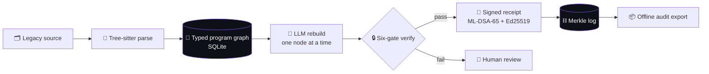
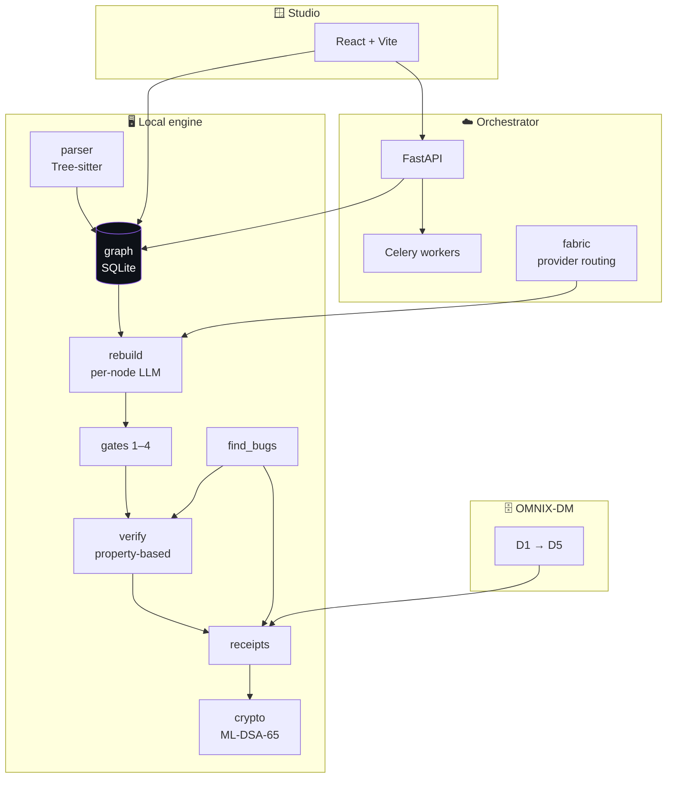
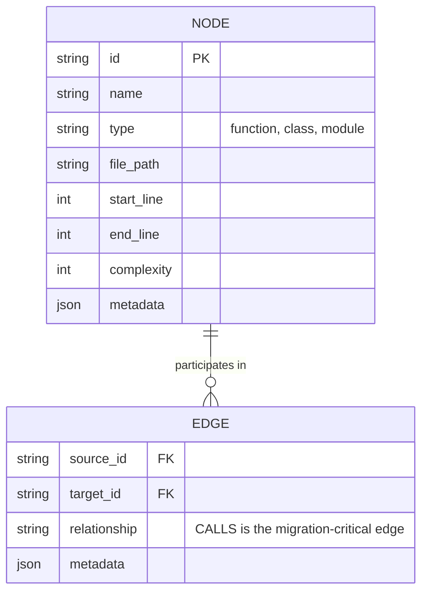
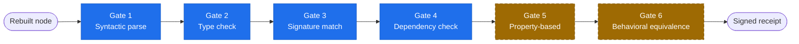
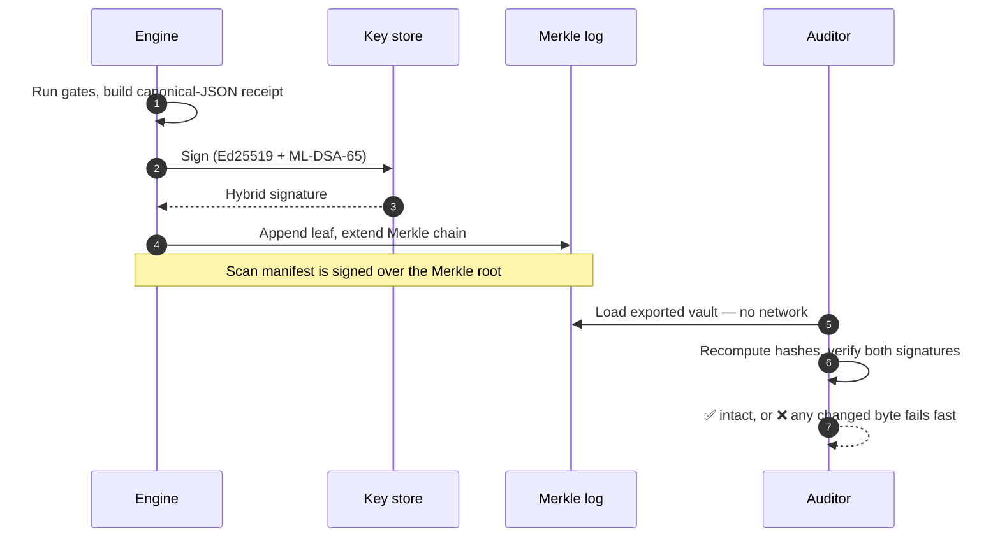
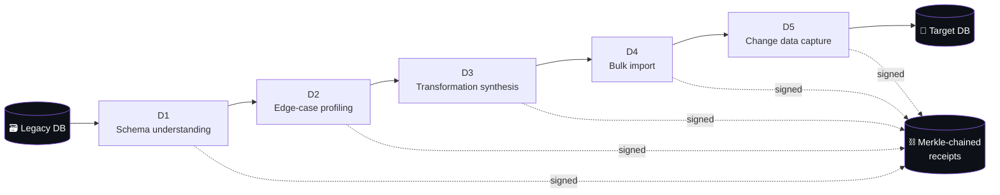
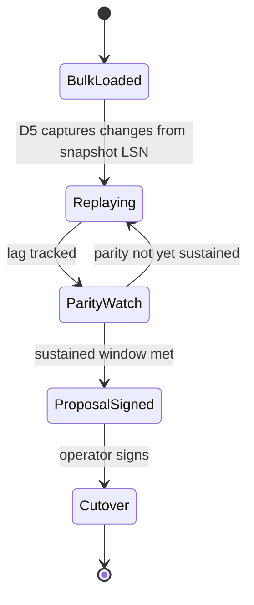
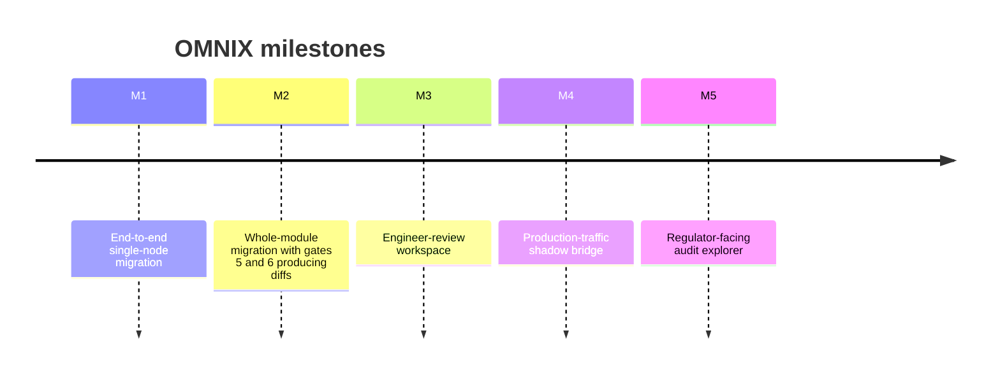

<div align="center">

# OMNIX

### Graph-native legacy migration with a cryptographically signed receipt for every transformation.

OMNIX parses a legacy codebase into a typed program graph, rebuilds it one node at a time with an LLM,
gates every rebuild through deterministic checks, and signs the result into a tamper-evident,
offline-verifiable audit trail.

<br/>

[](https://github.com/gowdaharshith1998-lang/OMNIX/actions/workflows/ci.yml)
[](https://github.com/gowdaharshith1998-lang/OMNIX/actions/workflows/codeql.yml)
[](pyproject.toml)
[-8957e5.svg)](docs/THREAT_MODEL.md)
[](LICENSE)

**[What it is](#-what-is-omnix) · [How it works](#-how-it-works) · [Architecture](#-architecture) · [Quickstart](#-quickstart) · [CLI](#-cli-reference) · [Status](#-project-status) · [Docs](#-documentation)**

</div>

> [!NOTE]
> The flowcharts below are live **Mermaid** diagrams — they render and zoom directly on GitHub.
> Collapsed `▸` sections expand inline. No site, no build step, just scroll.

---

<details>
<summary><b>📑 Table of contents</b></summary>

- [What is OMNIX](#-what-is-omnix)
- [How it works](#-how-it-works)
- [Architecture](#-architecture)
- [The program graph](#-the-program-graph)
- [Six-gate verification](#-six-gate-verification)
- [Signed receipts & the Merkle chain](#-signed-receipts--the-merkle-chain)
- [Data migration (D1–D5)](#-data-migration-d1d5)
- [Quickstart](#-quickstart)
- [CLI reference](#-cli-reference)
- [Project status](#-project-status)
- [Roadmap](#-roadmap)
- [FAQ](#-faq)
- [Documentation](#-documentation)
- [Contributing, security & license](#-contributing-security--license)

</details>

## 🧭 What is OMNIX

OMNIX is **not** an autonomous agent. It is closer to a compiler with an LLM as one of its passes, and
hard verification gates between every step. It parses a legacy codebase into a typed program graph,
rebuilds nodes into a modern target language, runs each rebuild through a six-gate verification
pipeline, and emits a cryptographically signed receipt that any third party can verify offline.



## ⚙️ How it works

The claim is **verified equivalence with auditable evidence** — not "provable," not "100% accurate." The
gates produce strong evidence; receipts produce a tamper-evident record.
Gate 6 establishes behavioral equivalence and signs its result into the receipt rather than asserting it
as proof.

> **The honesty boundary is structural.** Gates 1–4 run deterministically. Gates 5 and 6 are
> implemented as **`deferred` markers, not faked passes** — a receipt can never report "verified" for a
> check that did not run. Conflating "no verification ran" with "verification passed" would defeat the
> receipt's entire purpose, so it is disallowed in code.

Alongside the code-migration arm, OMNIX ships a data-migration layer (D1 schema understanding through
D5 change-data-capture), a FastAPI/Celery cloud orchestrator, a React Studio frontend, and a
provider-key vault. It is a hiring portfolio and commercial prototype, not yet a production-ready
service for real migrations.

<table>
<tr>
<td width="50%" valign="top">

**What OMNIX gives you**
- A typed, queryable graph of any supported codebase
- Per-node rebuilds with dependency context
- Deterministic gates between every step
- A signed, Merkle-chained receipt per finding & rebuild
- An audit bundle a third party verifies with no network

</td>
<td width="50%" valign="top">

**What OMNIX does not claim**
- It is **not** a one-click "rewrite my repo" button
- It does **not** assert mathematical proof of equivalence
- It does **not** mark deferred checks as passed
- It is **not** yet a production service for real migrations

</td>
</tr>
</table>

## 🏗️ Architecture

A universal Tree-sitter parser ingests source into a typed program graph stored in SQLite. Six grammars
are active today — **Python, TypeScript, Java, Go, Ruby, Rust** — with cross-file call resolution for
Python, TypeScript, and Rust. Files Tree-sitter cannot parse fall back to an LLM pass. Accepted rebuilds
emit a hybrid **ML-DSA-65 + Ed25519** receipt, anchored by an ML-DSA-signed scan manifest and chained in
a Merkle log.



<details>
<summary><b>▸ Module map</b></summary>

| Package | Role |
| --- | --- |
| `src/omnix/parser/` | Tree-sitter ingestion and language-specific symbol passes. |
| `src/omnix/graph/` | SQLite-backed typed program graph (`store.py`, `exporter.py`). |
| `src/omnix/rebuild/` | Per-node LLM rebuild runner. |
| `src/omnix/gates/` | Mechanical gates 1–4. |
| `src/omnix/verify/` | Hypothesis-driven property verification engine. |
| `src/omnix/receipts/` | Receipt schemas, Ed25519 + ML-DSA-65 signing, Merkle chaining. |
| `src/omnix/crypto/` | FIPS-204 ML-DSA-65 wrapper. |
| `src/omnix/find_bugs/` | Whole-codebase bug scan with signed findings. |
| `src/omnix/dm/` | Data-migration stages D1–D5. |
| `src/omnix/cloud/` | FastAPI API, Celery tasks, durable persistence. |
| `src/omnix/fabric/` | Provider Fabric: LLM dispatch, budgets, pricing. |
| `src/omnix/studio/` | Localhost Studio server and React frontend. |

Full design: **[ARCHITECTURE.md](ARCHITECTURE.md)**.

</details>

## 🧠 The program graph

The graph is the substrate everything else reads. Two tables — `nodes` and `edges` — in SQLite (WAL
mode, indexed for cheap call traversal). The migration-critical relationship is **`CALLS`**, the
function-to-function edge that cross-file resolution reconstructs.



## 🔒 Six-gate verification

Every rebuilt node flows through a six-gate model. **Gates 1–4 run mechanically today.** Gates 5 and 6
are **deferred and marked as such** — never reported as passed or failed (shown dashed below).



| Gate | Name | Status |
| :--: | --- | --- |
| 1 | Syntactic parse | ✅ runs |
| 2 | Type check | ✅ runs |
| 3 | Signature match | ✅ runs |
| 4 | Dependency check | ✅ runs |
| 5 | Property-based testing | ⏸️ deferred (M2) |
| 6 | Behavioral equivalence | ⏸️ deferred (M2) |

Gates 1–4 run **without short-circuiting**: every gate executes even if an earlier one failed, and a gate
crash is captured as a structured error rather than discarding the other gates' signals.

## 🧾 Signed receipts & the Merkle chain

Each finding and each rebuild carries a **hybrid signature**: a classical Ed25519 signature plus a
post-quantum ML-DSA-65 (FIPS 204) signature. Leaves are chained into a Merkle log, and the scan manifest
is signed over the Merkle root — so an auditor can detect a changed byte, a missing finding, or manifest
tampering **entirely offline**.



## 🗄️ Data migration (D1–D5)

OMNIX-DM is the data-migration arm beneath the code replicator. Five stages, each emitting **signed,
inspectable artifacts** chained by SHA-256 predecessor hash rather than a claim of proven correctness.



<details>
<summary><b>▸ D5 cutover state machine</b></summary>

After the bulk load, D5 replays live legacy writes via PostgreSQL logical replication, tracks lag, and
proposes cutover only once parity is sustained. **Cutover is never auto-actioned — an operator signs.**



Oracle (LogMiner) and MySQL (binlog) CDC adapters are present as explicit stubs that fail loudly rather
than silently no-op. Details: **[docs/dm/README.md](docs/dm/README.md)**.

</details>

## 🚀 Quickstart

> **Requirements:** Python 3.10+. The Studio frontend additionally needs Node 20+.

```bash
pip install -e .
omnix analyze /path/to/your/project
```

`analyze` parses the codebase, builds the graph under `<your-repo>/.omnix/omnix.db`, and starts the local
Studio server at `http://127.0.0.1:7777`. **Nothing is written back to your repo.** Use `--no-open` if you
only want the API. (`python omnix.py <cmd>` works identically before install.)

<details>
<summary><b>▸ Build the Studio UI (optional)</b></summary>

The Studio UI is a React app served from a build directory that is not checked in. Build it once:

```bash
cd src/omnix/studio/frontend && npm ci && npm run build && cd -
```

Without that build the server, CLI, and graph analysis all work in full; only the browser UI returns a
"build frontend" notice until the assets exist.

</details>

## 🖥️ CLI reference

<details open>
<summary><b>▸ Common commands</b></summary>

```bash
# Parse a codebase into the OMNIX graph
omnix analyze /path/to/project

# Property-based bug scan, with optional signed receipts
omnix find-bugs /path/to/project --emit-receipts

# Behavioral verification gates against the graph
omnix verify /path/to/project

# Parser grammar visibility
omnix grammar status
omnix grammar list

# Signed-receipt verification and offline audit export
omnix axiom keygen --project /path/to/project
omnix axiom verify-scan /path/to/receipts/dir \
  --ed25519-pubkey <pubkey> --mldsa-pubkey <pubkey>
omnix axiom export-vault /path/to/project --out audit.zip
```

Any changed byte, removed finding, or altered manifest makes `axiom verify-scan` fail quickly.

</details>

## 📊 Project status

OMNIX is active source-available software. The local code-intelligence and signed-receipt surfaces are
the most mature parts of the repo. Rebuild orchestration, hosted cloud scanning, and enterprise
deployment are present as implementation tracks, demos, or private-pilot surfaces.

| Surface | Status |
| --- | :--: |
| Local graph analysis, grammar visibility, bug scanning, signed finding receipts, audit export | 🟢 Available |
| Single-node Java rebuild demo ([docs/M1_DEMO.md](docs/M1_DEMO.md)) | 🟢 Demo flow |
| Full multi-node rebuild orchestration | 🟡 In progress |
| OMNIX-DM data migration D1–D5 ([docs/dm/](docs/dm/README.md)) | 🟡 Staged |
| Hosted cloud scanning, GitHub App, Helm/airgap deploy | 🔒 Private-pilot |

## 🗺️ Roadmap

Scoped around milestones, not dates. Full map: **[docs/PHASES.md](docs/PHASES.md)**.



## ❓ FAQ

<details>
<summary><b>Is this an AI agent that rewrites my repo automatically?</b></summary>

No. OMNIX is a pipeline with deterministic gates between every step, closer to a compiler than an agent.
The LLM proposes; the gates dispose; the receipt records exactly what was and was not verified.

</details>

<details>
<summary><b>What does "verified equivalence" mean here?</b></summary>

It means equivalence backed by auditable evidence from the gates and a tamper-evident receipt — **not**
"provable," **not** "100% accurate." Behavioral equivalence specifically is gate 6's job, which is
currently deferred and marked as such rather than faked.

</details>

<details>
<summary><b>Why post-quantum signatures?</b></summary>

Audit trails are meant to outlive the machine that produced them. ML-DSA-65 (FIPS 204) is paired with
classical Ed25519 in a hybrid signature so the trail stays verifiable through the post-quantum
transition. See [docs/THREAT_MODEL.md](docs/THREAT_MODEL.md).

</details>

<details>
<summary><b>Which source languages are supported?</b></summary>

Six grammars are active: Python, TypeScript, Java, Go, Ruby, and Rust, with cross-file call resolution
for Python, TypeScript, and Rust. Files Tree-sitter cannot parse fall back to an LLM pass. See
[docs/LEGACY_LANGUAGE_SUPPORT.md](docs/LEGACY_LANGUAGE_SUPPORT.md).

</details>

## 📚 Documentation

| Design & internals | Pipelines & demos |
| --- | --- |
| [ARCHITECTURE.md](ARCHITECTURE.md) — full system design | [docs/dm/README.md](docs/dm/README.md) — OMNIX-DM (D1–D5) |
| [docs/README.md](docs/README.md) — documentation index | [docs/M1_DEMO.md](docs/M1_DEMO.md) — single-node Java rebuild |
| [docs/THREAT_MODEL.md](docs/THREAT_MODEL.md) — security & trust model | [docs/QUALITY_PROFILE_BASELINES.md](docs/QUALITY_PROFILE_BASELINES.md) — quality baselines |
| [docs/LEGACY_LANGUAGE_SUPPORT.md](docs/LEGACY_LANGUAGE_SUPPORT.md) — source languages | [CHANGELOG.md](CHANGELOG.md) — release history |

## 🤝 Contributing, security & license

- **[CONTRIBUTING.md](CONTRIBUTING.md)** — how to set up, build, and propose changes
- **[SECURITY.md](SECURITY.md)** — vulnerability reporting (private channels only)
- **[GOVERNANCE.md](GOVERNANCE.md)** — how decisions are made
- **[CODE_OF_CONDUCT.md](CODE_OF_CONDUCT.md)** — community expectations
- **[.github/SUPPORT.md](.github/SUPPORT.md)** — how to get help
- **[LICENSE](LICENSE)** — source-available evaluation license (not OSI open source)

<div align="center">
<br/>

Maintained by **[Harshith Gowda](https://github.com/gowdaharshith1998-lang)** · [gowdaharshith1998@gmail.com](mailto:gowdaharshith1998@gmail.com)

<sub>OMNIX is source-available for evaluation and review under a custom license — not OSI open source.</sub>

</div>
