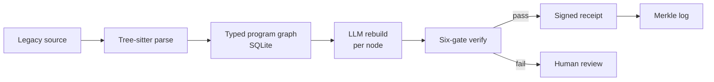

# OMNIX

**Graph-native legacy migration with a cryptographically signed receipt for every transformation.**

[](https://github.com/gowdaharshith1998-lang/OMNIX/actions/workflows/ci.yml)
[](https://github.com/gowdaharshith1998-lang/OMNIX/actions/workflows/codeql.yml)
[](pyproject.toml)
[](LICENSE)

- **Typed program graph** — Tree-sitter parsers build a typed graph of your codebase, stored in SQLite, with cross-file call resolution for Python, TypeScript, and Rust.
- **LLM rebuild** — modern target code is generated one structurally bounded graph node at a time, with dependency context, not as an opaque whole-repo rewrite.
- **Six-gate verification** — every rebuild passes deterministic syntax, type, signature, and dependency checks, plus property-based and behavioral-equivalence gates.
- **Signed, Merkle-chained receipts** — each finding and rebuild is signed with a hybrid ML-DSA-65 (FIPS 204 post-quantum) + Ed25519 signature and chained in a Merkle log.
- **Offline-verifiable audit export** — an export bundle a third party can verify without installing the full Python stack.
- **Source-available** — readable for evaluation and review under a custom license; not OSI open source.



## What is OMNIX

OMNIX is not an autonomous agent. It is closer to a compiler with an LLM as one
of its passes, and hard verification gates between every step. It parses a
legacy codebase into a typed program graph, rebuilds nodes into a modern target
language, runs each rebuild through a six-gate verification pipeline, and emits a
cryptographically signed receipt that any third party can verify offline.

The claim is verified equivalence with auditable evidence — not "provable," not
"100% accurate." The gates produce strong evidence; receipts produce a
tamper-evident record. Alongside the code-migration arm, OMNIX ships a
data-migration layer (D1 schema understanding through D5 change-data-capture), a
FastAPI/Celery cloud orchestrator, a React Studio frontend, and a provider-key
vault. It is a hiring portfolio and commercial prototype, not yet a
production-ready service for real migrations.

## Quickstart

Requires Python 3.10+. The Studio frontend additionally needs Node 20+.

```bash
pip install -e .
python omnix.py analyze /path/to/your/project
```

Installing the package registers the `omnix` console command, so `omnix analyze /path/to/your/project` works equivalently after install.

`analyze` parses the codebase, builds the graph under `<your-repo>/.omnix/omnix.db`,
and starts the local Studio server (`http://127.0.0.1:7777`). Nothing is written
back to your repo. Use `--no-open` if you only want the API.

The Studio UI is a React app served from a build directory that is not checked
in. Build it once (Node 20+):

```bash
cd src/omnix/studio/frontend && npm ci && npm run build && cd -
```

Without that build the server, CLI, and graph analysis all work in full; only
the browser UI returns a "build frontend" notice until the assets exist.

## Usage

```bash
# Parse a codebase into the OMNIX graph
python omnix.py analyze /path/to/project

# Property-based bug scan, with optional signed receipts
python omnix.py find-bugs /path/to/project --emit-receipts

# Behavioral verification gates against the graph
python omnix.py verify /path/to/project

# Parser grammar visibility
python omnix.py grammar status
python omnix.py grammar list

# Signed-receipt verification and offline audit export
python omnix.py axiom keygen --project /path/to/project
python omnix.py axiom verify-scan /path/to/receipts/dir \
  --ed25519-pubkey <pubkey> --mldsa-pubkey <pubkey>
python omnix.py axiom export-vault /path/to/project --out audit.zip
```

After `pip install -e .`, every `python omnix.py <cmd>` above can be written as
`omnix <cmd>`. Any changed byte, removed finding, or altered manifest makes
`axiom verify-scan` fail quickly.

## Architecture

A universal Tree-sitter parser ingests source into a typed program graph stored
in SQLite; six grammars are active today (Python, TypeScript, Java, Go, Ruby,
Rust), with cross-file call resolution for Python, TypeScript, and Rust. Files
Tree-sitter cannot parse fall back to an LLM pass. The rebuild stage dispatches
the LLM one graph node at a time with its dependency context, and each result
flows through the six-gate verification pipeline. Accepted nodes emit a hybrid
ML-DSA-65 + Ed25519 signed receipt, anchored by an ML-DSA-signed scan manifest
and chained in a Merkle log. A read-only localhost API and the React Studio let
you inspect the graph, findings, and receipts. See [ARCHITECTURE.md](ARCHITECTURE.md)
for the full design.

## Project status

OMNIX is active source-available software. The local code-intelligence and
signed-receipt surfaces are the most mature parts of the repo. Rebuild
orchestration, hosted cloud scanning, and enterprise deployment are present as
implementation tracks, demos, or private-pilot surfaces.

| Surface | Current status |
|---|---|
| Local graph analysis, grammar visibility, bug scanning, signed finding receipts, and audit export | Available in the local CLI / Studio path |
| Single-node Java rebuild demo | Available as an M1 demo flow; see [docs/M1_DEMO.md](docs/M1_DEMO.md) |
| Full multi-node rebuild orchestration | In progress |
| OMNIX-DM data migration phases D1–D5 | Implemented and documented in stages; see [docs/dm/](docs/dm/README.md) |
| Hosted cloud scanning, GitHub App, and Helm/airgap deployment | Private-pilot or enterprise deployment surfaces, not a public self-serve service from this repo alone |

The six gates are honest about maturity. Gates 1–4 (syntactic parse, type check,
signature check, dependency check) are deterministic and run in the M1 demo.
Gate 5 (property-based testing) and gate 6 (behavioral equivalence) are
intentionally **deferred** — explicitly marked as not-yet-verified rather than
faked.

## Roadmap

The project is scoped around milestones, not dates: end-to-end single-node
migration (M1), whole-module migration with gates 5 and 6 producing diffs (M2),
an engineer-review workspace (M3), a production-traffic shadow bridge (M4), and a
regulator-facing audit explorer (M5). See [docs/PHASES.md](docs/PHASES.md) for
the full completed/current/planned phase map.

## Who it's for

OMNIX targets engineering orgs modernizing long-lived codebases that need
auditable evidence of equivalence, not just a rewrite. For positioning, buyer
framing, and how OMNIX sits next to incumbent tooling, see
[docs/marketing/landing.md](docs/marketing/landing.md) and
[docs/marketing/marketplace_listing.md](docs/marketing/marketplace_listing.md).

## Documentation

**Design and internals**
- [ARCHITECTURE.md](ARCHITECTURE.md) — full system design
- [docs/README.md](docs/README.md) — documentation index
- [docs/THREAT_MODEL.md](docs/THREAT_MODEL.md) — security and trust model
- [docs/LEGACY_LANGUAGE_SUPPORT.md](docs/LEGACY_LANGUAGE_SUPPORT.md) — supported source languages

**Pipelines and demos**
- [docs/dm/README.md](docs/dm/README.md) — OMNIX-DM data-migration layer (D1–D5)
- [docs/M1_DEMO.md](docs/M1_DEMO.md) — single-node Java rebuild demo
- [docs/QUALITY_PROFILE_BASELINES.md](docs/QUALITY_PROFILE_BASELINES.md) — quality profile baselines

**Project**
- [CHANGELOG.md](CHANGELOG.md) — release history

## Contributing, Security, License, and Conduct

- [CONTRIBUTING.md](CONTRIBUTING.md) — how to propose changes
- [SECURITY.md](SECURITY.md) — vulnerability reporting
- [LICENSE](LICENSE) — source-available evaluation license (not OSI open source)
- [CODE_OF_CONDUCT.md](CODE_OF_CONDUCT.md) — community expectations
- [GOVERNANCE.md](GOVERNANCE.md) — project governance
- [.github/SUPPORT.md](.github/SUPPORT.md) — how to get help

Maintained by [Harshith Gowda](https://github.com/gowdaharshith1998-lang) ·
[gowdaharshith1998@gmail.com](mailto:gowdaharshith1998@gmail.com)
